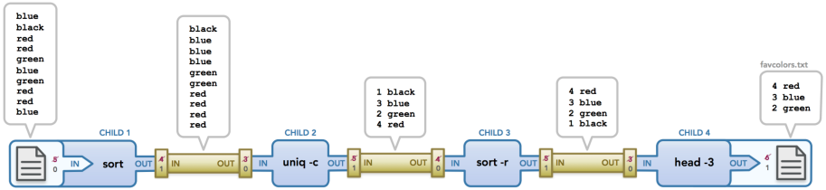

# Pipex


Pipex is a 42school project that reproduces the same behaviour as the command shell pipe **|** , 
The programme will lunch as  **./pipex file1 cmd1 cmd2 file2** and behave exactely as as this shell command line **< infile cmd1 | cmd2 > outfile**.

This programme will be written in C language, using the following functions : 
 access( ), open( ), unlink( ), close( ), read( ), write( ), malloc( ),   waitpid( ), wait( ), 
 free( ), pipe( ), dup( ), dup2( ), execve( ), fork( ), perror( ), strerror( ) and exit( ).


 


### Commands 
```
make mandatory = launch mandatory project 
make bonus 	   = launch bonus project
```


## Description 

### fork( )
Prototype :
```c
pid_t  fork ( void );
```
Create a child process from the current running one "parent process", withe the exact same since.
The only difference between the parent process and the child process is the assigned value: it returns 0 to the child process, a child [PID](https://en.wikipedia.org/wiki/Process_identifier#:~:text=In%20computing%2C%20the%20process%20identifier,uniquely%20identify%20an%20active%20process.) to the parent porcess, or -1 to the parent process in case of an error.

Resources :
[fork() in C](https://www.geeksforgeeks.org/fork-system-call/)
### wait( )
Prototype : 
```c
pid_t  wait ( int  * status );
```
Suspend the execution of the main process until it recives informations (stored in stat_loc) about the child process created by **fork( )**, when it's terminates.

Resources :
[Wait for a child process to end]((https://www.ibm.com/docs/en/zos/2.2.0?topic=functions-wait-wait-child-process-end))


  ####  >  exemple 
without wait( );

```c
#include	<stdio.h>
#include	<unistd.h>
#include	<sys/wait.h>
int main(int argc, char *argv[])
{
	int id = fork();
	int n;
	if(id  == 0)
	{
		n = 1;
	}
	else
	{
		n = 6;
	}
	int i;
	for(i = n; i < n + 5; i++)
	{
		printf("%d ", i);
	}
	return(0);
}
```

```c
┌──(cyber-z3ter㉿kali)-[~/Desktop]
└─$ gcc exemple.c
                                                                                
┌──(cyber-z3ter㉿kali)-[~/Desktop]
└─$ ./a.out        
6 7 8 9 10 1 2 3 4 5  

```

with wait( );

```c
#include	<stdio.h>
#include	<unistd.h>
#include	<sys/wait.h>
int main(int argc, char *argv[])
{
	int id = fork();
	int n;

	if(id  == 0)
	{
		n = 1;
	}
	else
	{
		n = 6;
	}
	if(id != 0)
	{
		wait(NULL);
	}

	int i;

	for(i = n; i < n + 5; i++)
	{
		printf("%d ", i);
	}
	
	return(0);
}
```

```c
┌──(cyber-z3ter㉿kali)-[~/Desktop]
└─$ gcc exemple.c
                                                                                
┌──(cyber-z3ter㉿kali)-[~/Desktop]
└─$ ./a.out      
1 2 3 4 5 6 7 8 9 10

```

### waitpid( )

Prototype : 
```c
pid_t  waitpid(pid_t pid, int *stat_loc, int options);
```

Waitpid() waits for a specific child equal to pid (given as paranmetre) to terminate. {need more explian}

>pid_t pid : Refers to the process ID on wiche **waitpid( )** should operate.

>int *static_loc : Pointer to an area where status information about how the child process ended is to be placed.

>int options : An integer field containing flags that define how **waitpid( )** should operate

Resources : 
  [Example of waitpid() in use](https://stackoverflow.com/questions/21248840/example-of-waitpid-in-use)
  [WAIT() AND WAITPID() API](https://techaccess.in/2021/05/07/wait-and-waitpid-api/)

### pipe( )
  Prototype :
  ```c
  int pipe(int fildes[2]);
  ```
  Ensure the communication between processes, or in some cases with the process itself. Thank's to the two pipe ends  **fildes[0]** who is used for reading from the pipe, and **fildes[1]** who is used for writing to the pipe.

Resources :
[How to use pipe function in C language](https://linuxhint.com/using_pipe_function_c_language/)
  
  ####  >  exemple

We sill send the string "Hello from file1" from one file1 to file2 using **pipe**
```c
#include	<stdio.h>
#include	<unistd.h>
#include	<sys/wait.h>
#include 	<fcntl.h>

int main(int argc, char *av[])
{
	int fd[2];
	char *file1 = "Hello from file1";
	char file2[17];
	
 	if(pipe(fd) == -1)
	printf("error");

	int id = fork();
	if(id == 0)
	{
		close(fd[0]);
		fd[0] = open("text.c", O_RDWR | O_CREAT  , 0666);
		write(fd[1], file1, (sizeof(char) * 16));
		close(fd[1]);
		
	}
	else
	{
		close(fd[1]);
		read(fd[0], file2, (sizeof(char) * 16));
		close(fd[0]);
		printf("%s", file2);
	}
	return(0);
}
```

```
┌──(cyber-z3ter㉿kali)-[~/Desktop]
└─$ gcc exemple.c && ./a.out
Hello from file1

```

### access( )
  Prototype :
  ```c
  access(const char *path, int mode);
  ```
  The function checks the file corresponding to the **path** following to the given **mode** 
  
  **F__OK** Existence of the file.
  
  **X_OK** Execute permission.
  
  **W_OK** Write permission.
  
  **R_OK** Read permission.
  
  ### unlink( )
  Prototype : 
  ```c
  int  unlink ( const  char  * path );
  ```
  The function deletes the given file as **pathe** by breaking the hard link 
  
  ####  >  exemple 
```c
#include	<stdio.h>
#include	<unistd.h>
int main(int argc, char *argv[])
{
	int i = 1;
	while(i < argc)
	{
		if(access(argv[i], F_OK) == 0) // checks the file if it exist
		{
			if(unlink(argv[i]) == 0)
			{
				printf("The file unlinked\n");
			}
			else
				printf("The file still linked\n");
		}
		else
			printf("The file doesn't exist\n");
		i++;
	}
	return(0);
}
```
```c
┌──(cyber-z3ter㉿kali)-[~/Desktop]
└─$ ls             
a.out  exemple.c  Pipex
                                                                                                                                                                                                                                              
┌──(cyber-z3ter㉿kali)-[~/Desktop]
└─$ gcc exemple.c && ./a.out a b c d
The file doesn't exist
The file doesn't exist
The file doesn't exist
The file doesn't exist

┌──(cyber-z3ter㉿kali)-[~/Desktop]
└─$ touch a b c d  

┌──(cyber-z3ter㉿kali)-[~/Desktop]
└─$ ls             
a  a.out  b  c  d  exemple.c  Pipex
                                                                             
┌──(cyber-z3ter㉿kali)-[~/Desktop]
└─$ gcc exemple.c && ./a.out  a b c d
The file unlinked
The file unlinked
The file unlinked
The file unlinked
                                                                              
┌──(cyber-z3ter㉿kali)-[~/Desktop]
└─$ ls             
a.out  exemple.c  Pipex
```


### dup( ) and dup2( )

Prototype : 
```c
 int dup(int fildes);
 int dup2( int oldfd, int targetfd ); 
```

The **dup** function duplicates a file descriptor, so as a result we get two **file descriptors** point to the same exact **file**.
the new file descriptor value is the smallest non-negative integer index in the per-process descriptor table

The **dup2** does the same as **dup**, but the difference is that the value of the new file descriptor **oldfd** is specified.


In case of an error the two functions return -1.

Resources : 
[practical examples use dup or dup2](https://stackoverflow.com/questions/1720535/practical-examples-use-dup-or-dup2)


### execve( )

Prototype :

```c
 int execve(const char *path, char *const argv[], char *const envp[]);
 ```

First thing to know is this function replace the calling process with another one constructed by the parametrse below.

 > const char *path : the pathname of the command to execute.

 > char *const argv[ ] :  a null-terminated array of character pointers to null-terminated character strings of arguments to pass to the new process.

 >char *const envp[ ] : Structured the same way as (char *const argv[ ]) but instead of an argument list, it holds a list of environment set for running the new program.

 Resources :
 [Introducing exec](https://medium.com/pragmatic-programmers/introducing-exec-3c9963375c98)


### [For more informations](https://www.rozmichelle.com/pipes-forks-dups/) 


  
 
